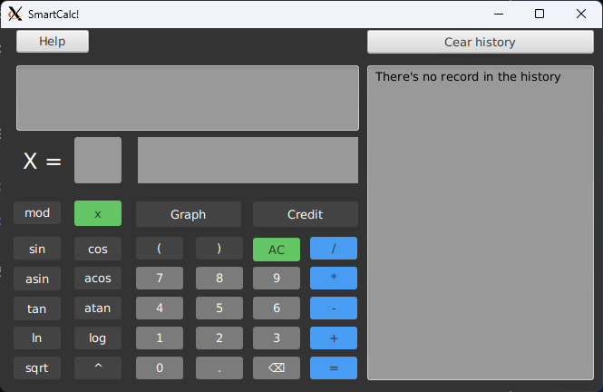

# SmartCalc v3.0

This is an extended version of the common calculator in the Java programming language that implements the same functionality as the application previously developed in the SmartCalc v2.0 project. The main development pattern is MVP (Model-View-Presenter).

### Features

* **Basic Arithmetic Operations**: Perform standard calculations such as addition, subtraction, multiplication, and division.
* **Advanced Mathematical Functions**: Includes trigonometric, logarithmic, and other advanced functions to support complex calculations.
* **Credit Calculator**: A feature that allows users to calculate loan payments using both annuity and differential methods.
* **Graph Plotting**: Visualize mathematical functions by plotting graphs directly within the application.
* **User-Friendly Interface**: An intuitive graphical user interface (GUI) built using JavaFX.

### Architecture

The project is structured according to the MVP (Model-View-Presenter) pattern, which divides the application into three core components:

* **Model**: Represents the data and business logic of the application. It handles the core calculations and processes without being concerned with the user interface. The model is implemented as a dynamic library in C++ and is reused from the SmartCalc v2.0 project. It is integrated into the Java environment through a JNI (Java Native Interface) wrapper, allowing seamless interaction between the native code and the Java application
* **View**: The user interface component. It is responsible for displaying the data to the user and capturing user inputs. The view is developed using JavaFX to create a responsive and visually appealing interface.
* **Presenter**: Acts as the intermediary between the Model and the View. It retrieves data from the Model, formats it for display, and updates the View accordingly. The Presenter also handles user interactions and commands the Model to update or process data as needed.

### Installation

1. **Build the Project**: 
   Navigate to the root directory of the SmartCalc project. Run the following command to compile and package the project:
   
   `mvn clean install`
   
   This command will also trigger the `build_app_linux.sh` script, which generates the necessary runtime image and builds the `.deb` installer package

2. **Install the `.deb` Package**: 
   Navigate to the `target/installer` directory, where the `.deb` package will be generated. Install the `.deb` package using `dpkg`:
   `sudo dpkg -i target/installer/smartcalc_1.0.0_amd64.deb`

### Usage

Once installed, SmartCalc can be launched from the applications menu or via the terminal. The executable file is located in the following path:

`/usr/local/bin`
